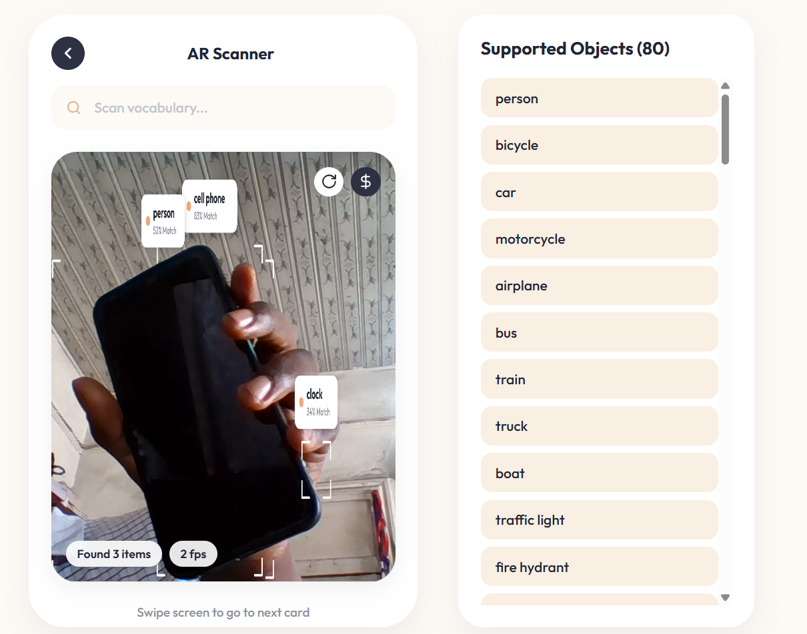

# AR Object Scanner 👁️‍🗨️

## Overview
The AR Object Scanner is an innovative augmented reality application that leverages real-time computer vision to identify and display detected objects directly within your camera feed. Built with TypeScript, Vite, and powered by ONNX Runtime Web, this project brings state-of-the-art YOLOv8 object detection capabilities to the browser, offering a seamless and interactive user experience.



## Features
-   **Real-time Object Detection**: Instantly identifies and categorizes objects within the live camera stream.
-   **Augmented Reality (AR) Overlays**: Displays detection bounding boxes with elegant corner brackets and floating labels, providing an immersive AR experience.
-   **YOLOv8 Model Integration**: Utilizes performant YOLOv8 `nano` and `small` ONNX models for accurate and efficient client-side inference.
-   **Client-side Inference**: Executes machine learning models directly in the browser using ONNX Runtime Web, ensuring privacy and low latency without server interaction.
-   **80-Class Vocabulary**: Reliably detects common objects across 80 distinct COCO categories (e.g. `person`, `cell phone`, `laptop`, `scissors`, `cup`). *(Note: AI detection is limited to these specific training categories).*
-   **Camera Stream Management**: Effortlessly starts, stops, and switches between available camera devices.
-   **Configurable Confidence Threshold**: Users can adjust the minimum confidence score to fine-tune detection sensitivity.
-   **Dynamic Performance HUD**: Real-time display of detection status and Frames Per Second (FPS).
-   **Responsive UI**: A clean, mobile-first design built with modern CSS for a consistent experience across devices.

## Getting Started

Follow these instructions to set up and run the AR Object Scanner on your local machine.

### Installation

1.  **Clone the Repository**:
    ```bash
    git clone https://github.com/samueltuoyo15/Object-Detect-Agent.git
    cd Object-Detect-Agent
    ```

2.  **Install Dependencies**:
    This project uses `pnpm` as its package manager. Ensure you have `pnpm` installed.
    ```bash
    pnpm install
    ```

### Running the Project

1.  **Start Development Server**:
    To run the application in development mode with hot-reloading:
    ```bash
    pnpm dev
    ```
    The application will typically be available at `http://localhost:5173`.

2.  **Build for Production**:
    To create a production-ready build of the application:
    ```bash
    pnpm build
    ```
    The compiled assets will be located in the `dist/` directory.

3.  **Preview Production Build**:
    To locally preview the production build:
    ```bash
    pnpm preview
    ```

## Usage

Once the application is running, you can interact with it as follows:

1.  **Start Scanning**: Click the central "Scan" button (🔍 icon) in the bottom navigation to activate your camera and begin real-time object detection. The HUD will show "Requesting camera..." then "Loading YOLO..." and finally "Running...".

2.  **Stop Scanning**: Click the "Stop" button (⏹️ icon) in the bottom navigation to halt the camera stream and object detection.

3.  **Model Selection**: In the "Settings" panel, use the "Model" dropdown to switch between `YOLOv8n (Fast)` and `YOLOv8s (Better)` models. The application will automatically reload the chosen model.

4.  **Confidence Threshold**: Adjust the "Min confidence" slider in the "Settings" panel to set the minimum score an object detection must have to be displayed. Lowering this value may show more detections but also increase false positives.

5.  **Camera Selection**: If you have multiple cameras connected, use the "Camera" dropdown to select which camera feed to use for detection.

As objects are detected, they will be highlighted with stylish AR overlays on the video feed, showing corner brackets, the object's label, and a confidence percentage.

### Supported Object Classes
The application utilizes models trained on the **COCO80** dataset. It can only detect objects within these 80 specific categories. 

Common supported objects include:
- **People**: Person
- **Vehicles**: Bicycle, Car, Motorcycle, Airplane, Bus, Train, Truck, Boat
- **Animals**: Bird, Cat, Dog, Horse, Sheep, Cow, Elephant, Bear, Zebra, Giraffe
- **Electronics**: TV, Laptop, Mouse, Remote, Keyboard, Cell Phone, Microwave, Oven, Refrigerator
- **Everyday Items**: Backpack, Umbrella, Handbag, Tie, Suitcase, Bottle, Wine Glass, Cup, Fork, Knife, Spoon, Bowl, Book, Clock, Vase, Scissors, Teddy Bear, Hair Drier, Toothbrush

*(Note: Items functionally similar but not explicitly in this list, such as a "phone cord" or "USB cable," may be incorrectly classified as visually similar shapes like "scissors" due to the constraints of the lightweight browser model).*

## Technologies Used

| Technology         | Description                                                          |
| :----------------- | :------------------------------------------------------------------- |
| **TypeScript**     | Strongly typed JavaScript for enhanced code quality and developer experience. |
| **Vite**           | Fast and modern build tool for front-end development.                |
| **Node.js**        | JavaScript runtime environment (used for build tools and development). |
| **ONNX Runtime Web** | High-performance inference engine for running ONNX models in the browser. |
| **YOLOv8**         | State-of-the-art, real-time object detection models.                |
| **HTML5**          | Standard markup language for structuring web content.                |
| **CSS3**           | Styling language for visually appealing and responsive interfaces.   |

## Contributing

We welcome contributions to the AR Object Scanner project! If you're looking to help, please consider the following:

*   ✨ **Feature Ideas**: Propose new functionalities or improvements to existing ones.
*   🐛 **Bug Reports**: Identify and report any issues you encounter.
*   🛠️ **Code Contributions**: Submit pull requests for bug fixes, new features, or code improvements.
*   📝 **Documentation**: Help improve and expand our project documentation.

To get started, please fork the repository and create a new branch for your changes. We appreciate your efforts!

## Author Info

Developed by **Samuel Tuoyo**

- *   **LinkedIn**: [samuel_tuoyo](https://www.linkedin.com/in/samuel-tuoyo-8568b62b6)
- *   **X**: [@TuoyoS26091](https://x.com/TuoyoS26091)

---
### Badges
[](https://www.typescriptlang.org/)
[](https://vitejs.dev/)
[](https://onnxruntime.ai/docs/tutorials/web/index.html)
[](https://ultralytics.com/yolov8)
[](https://nodejs.org/)

[](https://www.npmjs.com/package/dokugen)